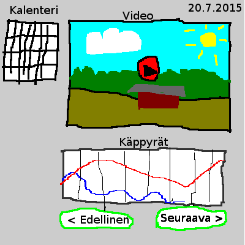

# TIEA207 Demo 2015
Esimerkkiprojekti aineopintojen projektityö-kurssille.
[MIT](LICENSE) lisensoitu.

## Synopsis
Mashup sovellus joka esittää Youtubesta saatavaa päivittäin kuvattua sääkamera-videomateriaalia ja esittää samassa näkymässä sääasemasta ladattua säähavainto-dataa.

 

# Development guide

    ## Setup & activate virtualenv (with help of virtualenvwrapper)

    # Without existing virtualenv (developing on Python 3.4.0):
    mkvirtualenv tiea207-demo -p python3
    pip install -r requirements.txt
    
    # With existing virtualenv:
    workon tiea207-demo

    # Run development server
    ./run-dev.py

Browse to http://localhost:5000

# Heroku deploy guide

With [Heroku Toolbelt](https://toolbelt.heroku.com/) installed and account configured:

1) Clone repository `git clone <repository url>`

2) Create Heroku app `heroku create <application_name>`

3) Push local repository to Heroku `git push heroku master`

4) Access application at `http://<application_name>.herokuapp.com`

# TODO
- [x] Kaiva videolinkit Youtubesta
- [x] Näkymä eri päivien valintaan
- [x] Päivä-näkymä
- [x] Käppyrät Chartkick kirjastolla
- [x] Deploy
- [x] Siirtymisnappulat
- [x] Sää-datan parsiminen
- [x] CSS
- [ ] Kalenterinäkymä
- [ ] Lisää sisältöä
